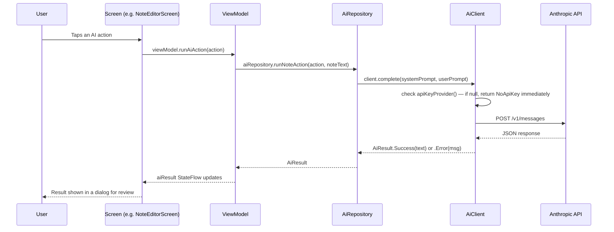

# 11 — AI System

## Provider

**Anthropic** (Claude models), called directly via HTTPS — no AI SDK/framework
wrapper (no LangChain, no Vercel AI SDK, etc.). See `docs/06_API_DOCUMENTATION.md`
for the full request/response contract.

## Model

Hardcoded in `core/ai/AiClient.kt`:
```kotlin
private val model: String = "claude-sonnet-4-6"
```
⚠️ **Flag for review**: this exact string should be checked against
Anthropic's current model catalog before relying on it — it was not
independently tested against a live API call while building this app (no
network access was available). It is swappable in one place (`AiClient`'s
constructor parameter).

## Where AI logic lives in the repository

| File | Role |
|---|---|
| `core/ai/AiClient.kt` | Low-level HTTP client — builds the request, calls Anthropic, parses the response. The **only** file that performs the network call. |
| `core/ai/AiRepository.kt` | Prompt assembly — one function per feature (note actions, task extraction, diary drafting, weekly review, chat). The **only** file that calls `AiClient`. |
| `core/ai/AiModels.kt` | Data models: `NoteAiAction` enum (the 12 note actions), `ExtractedTask`, `ChatMessage`, `AiResponseCard` |

## Processing flow



## Input / Output per feature

| Feature | System prompt theme | Input sent | Output |
|---|---|---|---|
| Note actions (12 variants) | "You are the LifeOS AI Assistant..." (shared base prompt in `AiRepository.baseSystemPrompt`) + a per-action instruction (e.g. "Summarize the following note in 2-4 concise sentences.") | The note's flattened plain text | Free text, shown in an `AlertDialog` — never auto-applied to the note |
| Extract tasks | Instructs a plain list output, one task per line, "NONE" if nothing found | The note's plain text | Parsed by `AiRepository.parseExtractedTasks()` into `ExtractedTask(title, dueDateHint)`, shown in a confirm dialog with a "CREATE TASKS" button |
| Draft diary entry | Instructs a natural first-person 3-6 sentence entry, "do not add events not implied by the notes" | The user's raw typed thoughts | Saved directly as a `DiaryEntity` with `aiGenerated=true, isReviewed=false` |
| Weekly review | Instructs an encouraging 4-6 sentence summary, "do not invent numbers not present above" | A pre-computed stats string (task count, spend total, diary count) — not raw records | Free text shown in a card |
| AI Assistant chat | Same base prompt | Full conversation history (`List<ChatMessage>`); `contextBlock` param exists but is always passed as `null` from `AiAssistantScreen.kt` | Free text appended to the chat |

## Context handling

⚠️ Important nuance for a new developer: `AiRepository.chat()` is written to
accept an optional `contextBlock: String?` so the AI Assistant *could* be
given real app data (e.g. "here are your tasks today") — but
`ui/ai/AiAssistantScreen.kt` currently always calls it with
`contextBlock = null`. **The chat assistant today only ever sees the
conversation itself, not the user's actual notes/tasks/habits/expenses.**
Wiring real context into the chat is a clear, well-scoped next step (the
plumbing already exists; it's the call site that needs the extra argument).

## Error handling

See `docs/06_API_DOCUMENTATION.md`'s error-cases table. Every screen that
calls AI shows one of three outcomes to the user: the result text, an
`"AI error: <message>"` string, or `"Add your AI API key in Settings..."`.
There is no retry logic and no exponential backoff — a failed call requires
the user to tap the action again.

## Cost considerations

⚠️ **NOT VERIFIED FROM CODEBASE** — there is no cost estimation, token
counting, or usage-tracking code anywhere in the app. Every AI call uses
the end user's own API key, so any cost is billed directly to that user's
Anthropic account, not to the app developer. There is no in-app indication
of estimated cost before a call is made.

## Rate limits

⚠️ **NOT VERIFIED FROM CODEBASE** — the app implements no client-side rate
limiting or request queuing. If Anthropic's API returns a rate-limit error
(HTTP 429), it will surface generically as `AiResult.Error("AI request
failed (429): ...")` — there is no special handling or user-friendly
messaging for this specific case.

## Security / Data privacy

- The AI API key is stored locally via `core/util/SettingsStore.kt`
  (Android DataStore Preferences) — **not encrypted** (see `docs/08_SECURITY.md`
  finding #1).
- Only the minimum text needed for each specific action is sent (verified
  per-feature in the table above) — the app does not send the whole
  database or unrelated personal data with any AI call.
- No AI response is ever written to the database without an explicit user
  approval step:
  - Extracted tasks require tapping "CREATE TASKS" in a confirmation dialog
    (`NoteEditorScreen.kt`)
  - AI-drafted diary entries are saved with `isReviewed = false` and require
    tapping "Approve" in `DiaryScreen.kt` before they're treated as reviewed

## What's implemented vs. planned

**Implemented** (all of the above): note actions, task extraction, diary
drafting, weekly review, and a basic chat assistant — all working, real
network calls, not mocked or stubbed.

**Planned / referenced but not built**:
- Semantic/AI-powered search — ⚠️ **NOT IMPLEMENTED**; `docs/01_PRODUCT_REQUIREMENTS.md`
  confirms `SearchScreen.kt` uses plain SQL, no embeddings
- Feeding real app context into the AI Assistant chat — plumbing exists
  (`contextBlock` parameter) but not connected, as noted above
- Any form of local/on-device AI model — everything is cloud API-based
